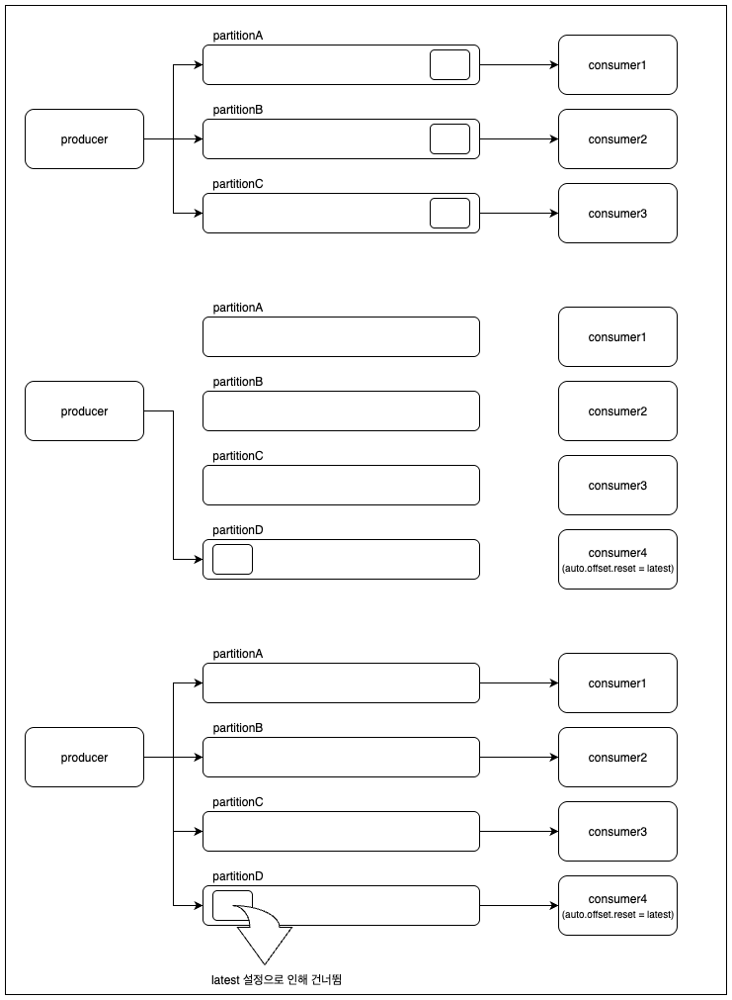

# 파티션을 증가로 인해 발생할 수 있는 문제

카프카는 파티션에 하나의 컨슈머만 할당된다. 그렇기 때문에 메세지 처리량을 증가시키기 위해서 파티션 수를 늘려야할 상황이 생길 수 있다. 그런데 파티션을 늘릴 때 중요하게 고려해야할 부분이 있어 해당 내용을 정리하려고 한다.

## 1. 파티션 수는 늘릴 수만 있고, 줄일 수는 없다

- 파티션 수를 다시 줄일 수는 없기 때문에 메세지 발행 건수가 줄어들더라도 늘어난 파티션을 계속 유지해야 함
- 파티션을 늘리면, 로그 세그먼트 파일만 생성되는 것이 아니라, 쌓인 로그에 대한 메타 정보 파일(.index, .timeindex, .snapshot)도 함께 저장
- 파일을 여는 I/O 비용과 디스크 사용량이 추가 발생
- 한 브로커가 맡은 파티션 리더 수가 증가하기 때문에 브로커 장애 발생이나 재시작에 의해 파티션 리더 선출 등이 필요한 파티션 수 증가
- 리플리케이션은 파티션 단위로 이뤄지기 때문에 파티션 수가 증가하면, 리플리케이션으로 인한 디스크 사용량, 레이턴시 증가

## 2. 메세지 키가 같더라도 처리되는 컨슈머가 달라질 수 있다

- 메세지 키가 같으면 동일한 파티션에서 처리되는 것이 기본적인 프로듀서 파티셔너의 동작 방식
- 해시 테이블에서 메세지 키를 해시한 값으로 처리될 파티션을 가져오기 때문에 파티션이 늘어나면 해시 테이블도 달라져 동일한 메세지 키라도 다른 파티션에 전송될 수 있음
- 파티션은 결국 처리될 컨슈머와 연관되기 때문에 동일 메세지 키로 다른 컨슈머에서 처리 됨
- 메세지가 처리되는 순서가 중요한 프로세스 등 키가 같은 메세지가 동일한 컨슈머에서 처리되어야 할 경우, 파티션 증가는 부작용을 유발

## 3. latest로 설정된 컨슈머에서 메세지 유실이 발생할 수 있다

1. 기존에는 파티션A, 파티션B, 파티션C 사용
2. 처리량 증가를 위해 파티션D, 컨슈머4를 추가
3. 컨슈머4는 `auto.offset.resest=latest` 설정
   - `latest` 설정 시 할당 된 파티션에 대한 오프셋 정보가 없을 경우 기존에 존재하는 메세지는 무시
   - 컨슈머는 새로 들어온 메세지부터 소비 시작
4. 컨슈머가 파티션에 할당되기 전에 프로듀서가 메세지를 발송
5. 컨슈머는 `latest`로 설정되어 있어 할당 이전 메세지는 무시
6. 프로듀서 메세지 발송 시점과 파티션 할당 시점 사이에 발행된 메세지는 모두 처리 되지 않는 문제 발생
